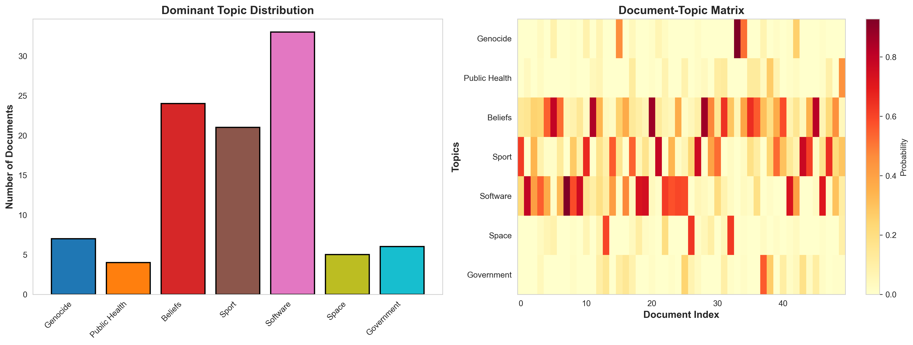

# LDA Topic Modeling

A comprehensive Python project for training, labeling, and performing inference on Latent Dirichlet Allocation (LDA) topic models. This pipeline processes text documents, identifies topics, and classifies new documents.

## Project Structure

```
.
├── 1_training.py           # Model training pipeline
├── 2_labeling.py           # Topic labeling interface
├── 3_inference.py          # Document classification
├── visualizations.py       # Visualization generation
├── models/                 # Trained model files
│   ├── dictionary.dict     # Word-to-ID mapping
│   ├── lda_model           # Trained LDA model
│   ├── lda_model.state     # Model state
│   ├── lda_model.id2word   # ID-to-word mapping
│   ├── lda_model.expElogbeta.npy
│   └── topic_labels.json   # Human-assigned topic names
└── visualizations/         # Generated visualizations
```

## Features

### 1. **Training** (`1_training.py`)

- Load and preprocess documents
- Remove stopwords and tokenize text
- Create dictionary and corpus from processed documents
- Train LDA model with configurable parameters (7 topics, 30 passes)
- Display and save trained topics with top keywords

### 2. **Labeling** (`2_labeling.py`)

- Interactive topic labeling interface
- Display topic keywords and assign human-readable names
- Save labels to `models/topic_labels.json`
- Create summary of all labeled topics

### 3. **Inference** (`3_inference.py`)

- Load trained model, dictionary, and topic labels
- Classify new documents and get topic probabilities
- Preprocess input text using same pipeline as training
- Display results with topic names and confidence scores
- Interactive and batch classification modes

### 4. **Visualizations** (`visualizations.py`)

- Topic-word heatmap
- Top words bar charts by topic
- Document-topic distribution analysis
- Word clouds for each topic

## Topics

The model identifies 7 topics:

| Topic ID | Label |
|----------|-------|
| 0 | Genocide |
| 1 | Public Health |
| 2 | Beliefs |
| 3 | Sport |
| 4 | Software |
| 5 | Space |
| 6 | Government |

## Visualizations




## Installation

1. Create virtual environment:

```bash
python -m venv venv
venv\Scripts\activate
```

1. Install dependencies:

```bash
pip install gensim nltk pandas scikit-learn matplotlib wordcloud
```

1. Download NLTK data (required for stopwords):

```python
python -c "import nltk; nltk.download('stopwords')"
```

## Usage

### Step 1: Train Model

```bash
python 1_training.py
```

- Loads documents from dataset
- Preprocesses and trains LDA model
- Saves model files to `models/`

### Step 2: Label Topics

```bash
python 2_labeling.py
```

- Displays topics with keywords
- Prompts for human-assigned labels
- Saves labels to `models/topic_labels.json`

### Step 3: Classify Documents

```bash
python 3_inference.py
```

- Interactive menu for document classification
- Choose between sample documents or custom text
- Returns topic probabilities and key words

### Step 4: Generate Visualizations

```bash
python visualizations.py
```

- Creates all visualizations
- Saves to `visualizations/` directory

## Model Details

- **Algorithm**: Latent Dirichlet Allocation (LDA)
- **Number of Topics**: 7
- **Training Passes**: 30
- **Vocabulary Size**: ~2000+ unique terms
- **Framework**: Gensim

## Key Components

### Preprocessing Pipeline

- Text lowercasing
- Tokenization
- Stopword removal (English)
- Dictionary creation (word → ID mapping)

### Model Files

- `dictionary.dict`: Maps words to numeric IDs
- `lda_model`: Core trained model
- `lda_model.state`: Model training state
- `lda_model.id2word`: Reverse mapping (ID → word)
- `topic_labels.json`: Human-assigned topic names